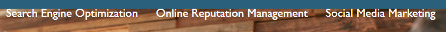
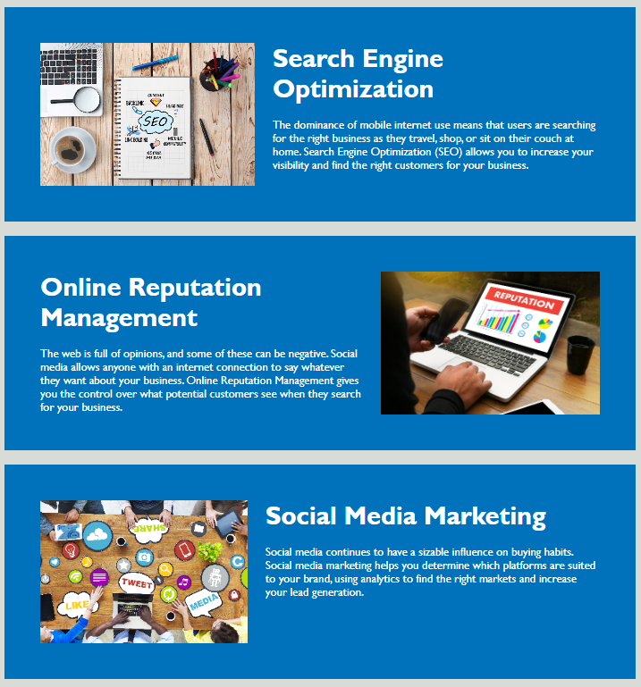
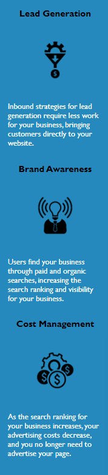

# Module-1-Challenge

## Description
After utilizing web-based resources and instructional support, this project helped me to apply classroom knowledge and practice technical skills. The end goal of this project is to grow a customer base for a mock company, Horiseon. Given starter code, modifications were made to improve web accessibility. When a codebase follows accessibility standards, the site is optimized for search engines. As a result, site traffic increases and costs for advertising decrease, maximizing profit.

I learned about the difference between semantic and non-semantic elements in HTML. I learned how to identify repeating elements and consolidate CSS selectors. I organized CSS selectors to follow the semantic structure of the HTML elements.

## Table of Contents 

- [Installation](#installation)
- [Usage](#usage)
- [How-To-Guide](#how-to-guide)
- [Credits](#credits)
- [License](#license)

## Installation

N/A

## Usage

The company, Horiseon, is a marketing agency. The company website has a horizontal navigation bar with three items. 

Each item provides a link to the related figure below. The figures provide information on the services the company provides. 

There is an aside to the right of the figures. The information in the aside describes the benefits of hiring this marketing agency. 

## How-To-Guide
<ol>
    <li>    Clone starter code </li>
                <ul>
                    <li> Create new repository on GitHub account, called "Module-1-Challenge"
                    </li>
                    <li> Clone repo to local machine
                    </li>
                    <li> Follow link to starter code
                    </li>
                    <li> Use command line to navigate to Module-1-Challenge folder
                    </li>
                    <li> Clone starter code
                    </i>
                </ul>
    <li> Refractor the code to meet the Acceptance Criteria </li>
                <ul>    
                    <li> GIVEN a webpage meets accessibility standards </li>
                    <li> WHEN I view the source code </li>
                    <li> THEN I find semantic HTML elements </li>
                    <li> WHEN I view the structure of the HTML elements </li>
                    <li> THEN I find that the elements follow a logical structure independent of styling and positioning </li>
                    <li> WHEN I view the image elements </li>
                    <li> THEN I find accessible alt attributes </li>
                    <li> WHEN I view the heading attributes </li>
                    <li> THEN they fall in sequential order </li>
                    <li> WHEN I view the title element </li>
                    <li> THEN I find a concise, descriptive title </li>
                </ul>
    <li> Push changes to the remote repository </li>
                <ul>    
                    <li> git add -A </li>
                    <li> git status </li>
                    <li> git commit -m "commit message" </li>
                    <li> git push </li>
                </ul>
    <li> Create README </li>
    <li> Push changes to the remote repository </li>
    <li> Submit Challenge for review </li>
</ol>

## Credits
<ul>
<li> Tutoring session with Alexis "Alex" Gonzalez  </li>
<li> <a href="https://github.com/RyanPetersen-89">Ryan Peterson's project</a> was used as a reference </li>
<li> HTML Crash Course For Absolute Beginners  </li>
<li> CSS Crash Course For Absolute Beginners  </li>

## License

Please refer to the LICENSE in the repo.

# [link to completed project](file:///C:/Users/aandh/bootcamp/Module-1-Challenge/index.html)

